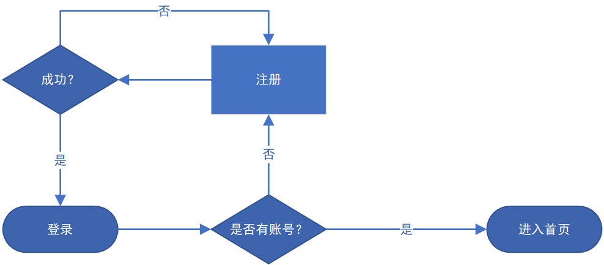
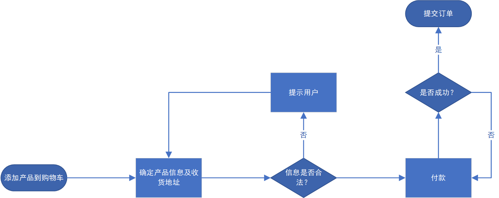
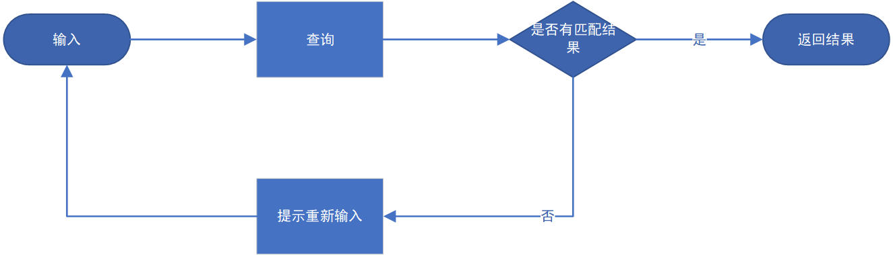
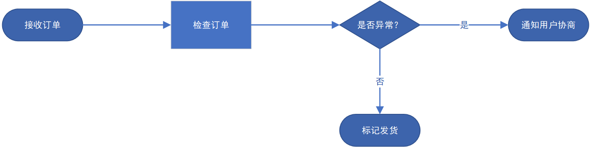

# 可行性分析报告——商品网上交易系统

- 黄振川：1.2、1.3、2、3.1、3.2、5.2、10、11
- 刘明康：1.1、1.4、5.1、11
- 王硕：1.1、1.2、1.4、5.1、5.2、6.3
- 殷嘉鸿：1.1、3.3、5.1、5.5、6.1、6.2、6.3
- 张谱原：1.1、3.3、5.1、5.2、7、8、9

# 第 1 章 引言

## 1.1 标识

- **后端框架**：Spring Framework 5.3.20 + Spring MVC 5.3.20 + MyBatis 3.5.9
- **前端框架**：HTML5 + CSS3 + Javascript ES6
- **数据库**：MySQL 5.7
- **服务器**：Apache Tomcat 9.0.56
- **开发工具**：IDEA 2024.3.3、Maven 3.9.9
- **运行环境**：JDK 1.8

## 1.2 背景

考虑到传统中小企业缺乏自建电商的能力，以及当前消费者线上购物的习惯日益成熟，传统企业数字化转型需求日益增加，需通过自营平台减少对第三方电商平台的依赖，因此本团队决定开发这样一个基于 B2C 模式的商品交易平台。该交易平台是基于 SSM（Spring + SpringMVC + MyBatis）框架的，该框架成熟稳定，适合快速构架 Java Web 项目。

## 1.3 项目概述

本项目旨在实现一个基于 B2C 模式的商品网上交易系统，项目启动于 2025 年 2 月 28 日。项目开发前期的主要任务是确定本项目的最终目标、所要实现的功能以及面向的用户群体等。中期的主要任务是对前期所确定的具体功能进行基本开发，并在过程中根据需求动态调整开发策略。后期的主要任务是对中期的开发进行完善与总结。

## 1.4 文档概述

本文档主要用于了解本项目所具备的功能以及其他相关的可行性分析。在阅读本文档后，应当能够对本项目具有基本而直观的了解。本文档旨在为商品网上交易系统项目的建设提供决策依据，通过技术可行性、经济效益、运营流程及法律合规性四维分析，评估项目实施的可行性。本文档整体设定为机密级，核心财务模型及技术架构限定项目决策层访问权限，开发团队仅开放技术实施方案接口并隔离商业运营数据；物理文件存放于档案室；涉及测试数据均执行格式保留型脱敏处理，数据跨境传输严格遵循 GDPR 与《个人信息保护法》双重要求，通过认证加密链路完成交互。

# 第 2 章 引用文件

本文档主体参照 GB/T 8567-2006 计算机软件文档编制规范中的可行性分析报告（FAR）。由于本项目较小，并且本文档适用于本项目开发的初期阶段，因此不会（也不能）涉及 FAR 中的所有标准章节，但为了保持文档结构的完整性，对于其中不涉及（或在初期分析时暂时不涉及）的方面，将在对应的章节后以 TBA（To Be Announced）的方式标注。

# 第 3 章 可行性分析的前提

## 3.1 项目的要求

本项目的基本功能要求如下：
- **用户管理**：主要包括用户注册、登录、留言等功能模块。游客可以通过填写必要信息，并根据其中填写的手机号码获取验证码，进而注册并登录账号，每个手机号码能且仅能关联一个账号，因此在用户注册时需要对此进行检查。原则上，对于未注册的游客仅具备浏览平台产品的权限，其他功能模块（如购物、留言等）仅限注册并已经登录的合法用户。
- **商品管理**：主要包括发布在线产品展示功能（包含产品图片、产品名、产品价格及库存余量等）以及对商品信息的管理。原则上，本功能仅限具备管理员权限的用户进行操作，其他所有一般用户不应当具备发布商品的权限。
- **用户购物**：主要包括用户通过站内实现的搜索引擎（在前端界面上显示为一个搜索输入框）对平台产品进行在线查找的操作，并可以对所需产品进行在线下单操作。搜索引擎的实现应当考虑到用户对于产品的模糊描述。对每个用户均应实现用户个人的购物车，用户可以将所需产品添加到个人购物车中，并且可以在购物车中查看产品信息、修改产品的数量（包括移除后续不需要的产品）、确定用户期望的收货地址并最终进行产品价格结算等功能。
- **产品配送**：主要包括买家和卖家对订单的一系列操作，卖家在确认买家提交的订单后可以修改订单状态为出货，买家收到产品后能将订单状态修改为已收货，随后交易成功结束。

## 3.2 项目的目标

本项目旨在实现一个基于 B2C 模式的商品网上交易系统，因此该交易系统在原则上是遵循只有一个卖家、允许多个买家的交易模式，即该交易系统原则上是面向个体商户或单一品牌的，这不同于 C2C 模式。

## 3.3 项目的环境、条件、假定和限制

本项目的预期开发环境主要包括 JDK 1.8 及 MySQL 5.7。开发工具包括 IDEA 2024.3.3、Maven 3.9.9。

## 3.4 进行可行性分析的方法（TBA）

# 第 4 章 可选的方案（TBA）

# 第 5 章 所建议的系统

## 5.1 对所建议的系统的说明

- **后端框架**：Spring Framework 5.3.20 + Spring MVC 5.3.20 + MyBatis 3.5.9
- **前端框架**：HTML5 + CSS3 + Javascript ES6
- **数据库**：MySQL 5.7
- **服务器**：Apache Tomcat 9.0.56
- **开发工具**：IDEA 2024.3.3、Maven 3.9.9
- **运行环境**：JDK 1.8

## 5.2 数据流程和处理流程

- **用户登录/注册模块**：

- **用户购物模块**：

- **用户搜索模块**：

- **平台发货模块**：

## 5.3 与原系统的比较（若有原系统）（TBA）

## 5.4 影响（或要求）（TBA）

## 5.5 局限性

- **技术局限性**：SSM 框架虽然成熟，但在处理高并发场景时性能可能不如微服务架构。
- **资源局限性**：开发团队规模较小，可能影响开发进度和功能完善度；服务器资源有限，可能在高并发场景下出现性能瓶颈。

# 第 6 章 经济可行性（成本-效益分析）

## 6.1 投资

- **硬件成本**：
  - 服务器（1 台，用于部署应用）6000 元
- **软件成本**：
  - 开发工具（IntelliJ IDEA Ultimate 版）2000 元
  - 数据库（MySQL，免费使用）0 元
- **运营成本**：
  - 域名注册费用（每年）500元

## 6.2 预期的经济效益

通过收取交易佣金或广告费用实现盈利。假设平台每年完成 10,000 笔交易，每笔交易平均佣金为5元，年收入为 50,000 元。广告收入每年预计为 20,000 元。预计年总收入70,000 元。

## 6.3 市场预测

基于 B2C 模式的交易平台，如果能够成功吸引优质商家入驻，并提供高质量的商品和良好的用户体验，仍然具有很大的市场潜力。用户对于性价比高的商品需求旺盛，而 B2C 模式能够提供更稳定和有保障的商品来源。

# 第 7 章 技术可行性（技术风险评价）

本项目的开发人员均已知晓并理解本项目的要求及目标，并具备基本的个人开发能力及团队协作精神，具备大量的代码编写经历及相关能力，有一定的前后端学习经历，曾经均有过学习开发类似平台的经历，因此，从本团队的技术能力出发，预期是能够完成本项目的最终开发的。

# 第 8 章 法律可行性

本项目所参考的开源项目遵循 MIT 开源协议，发布时标注源码作者的版权信息即可。

# 第 9 章 用户使用可行性

本项目预期实现的界面应以简洁易操作为特点，对于一般用户而言能够方便快速地了解并熟悉本项目的使用方法。

# 第 10 章 其他与项目有关的问题

在未来的开发过程中，本项目所包含的具体功能实现可能会依据实时需求动态调整，但在 3.2 节中所阐述的项目目标应当维持不变。

# 第 11 章 注解

本章应包含有助于理解本文档的一般信息（例如原理），应包含为理解本文档需要的术语和定义，所有缩略语和它们在文档中的含义的字母序列表。

- **B2C 平台**：B2C 是企业对消费者的电子商务模式，全称即 Business to Consumer。这种形式的电子商务一般以网络零售业为主，主要借助于 Internet 开展在线销售活动。
- **C2C 平台**：C2C 电子商务平台‌是指个人与个人之间的电子商务平台，全称即 Consumer to Consumer。在这种模式下，卖家通常是个人或小型商家，通过互联网平台发布商品信息，买家则可以在平台上搜索、比较和购买心仪的商品。C2C 平台为买卖双方提供交易所需的一系列配套服务，包括支付、物流等‌。
- **MIT 开源协议**：MIT 许可证（The MIT License）是许多软件授权条款中，被广泛使用的其中一种。与其他常见的软件授权条款（如 GPL、LGPL、BSD）相比，MIT 是相对宽松的软件授权条款。MIT 许可证之名源自麻省理工学院（Massachusetts Institute of Technology），又称“X 条款”（X License）或“X11 条款”（X11 License）。被授权人有权利使用、复制、修改、合并、出版发行、散布、再授权及贩售软件及软件的副本；被授权人可根据程序的需要修改授权条款为适当的内容。被授权人在软件和软件的所有副本中都必须包含版权声明和许可声明。

# 附录（TBA）

附录可用来提供那些为便于文档维护而单独出版的信息（例如图表、分类数据）。为便于处理附录可单独装订成册。附录应按字母顺序（A，B 等）编排。
